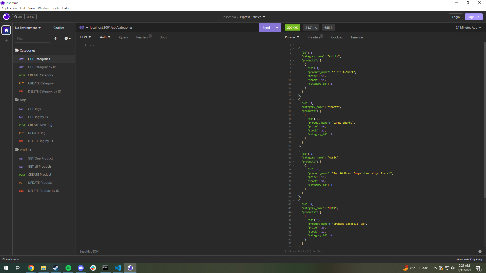
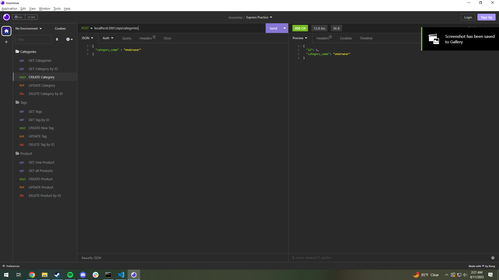
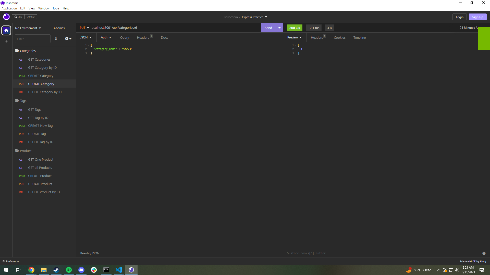
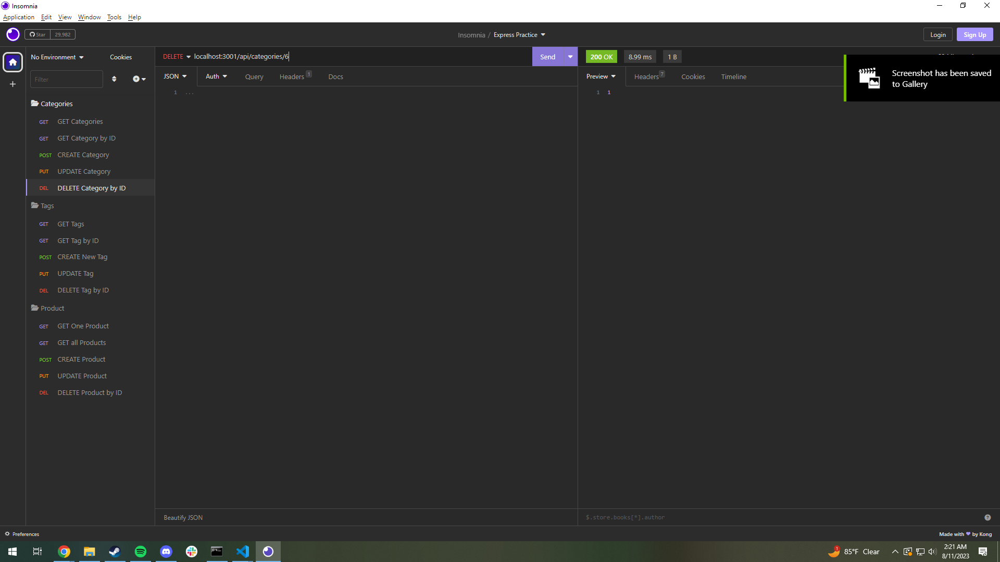

# e-commerce-site

## Description
This program utilizes ORM to generate the back end for an e-commerce site. Creating this project is a huge help to give me a greater understanding of routing, models, and using Insomnia in a demonstrative way. This program is a good way to help visualize the back end for a website with large amounts of intractable data and how to organize it.

## Table of Contents
- [Installation](#installation)
- [Usage](#usage)
- [License](#license)
- [Credits](#credits)
- [Questions](#questions)

## Installation
Clone repository by copying the ssh key and using ```git clone {ssh Key}``` in your git bash terminal.

Once cloned install node.js packages by inputting ```npm i```.

## Usage

After cloning the repository log into your mysql and start the db using ```SOURCE db/schema.sql;```. Then run the seeds with ```npm run seed```. Finally, start the server with ```node server.js``` and or ```nodemon server.js``` if nodemon is globally installed on your system.

Video Demo link:


CRUD Operations in Insomnia:









## License
[](https://opensource.org/licenses/MIT)

This application is covered under the MIT license.

## Credits

Starter code from UTA Boot camp.

 Node packages used:
  - MySQL2
  - Sequelize
  - Express
  - dotenv

## Questions
GitHub: [Turbdorb](https://github.com/Turbdorb)

Email: <brymerjared@gmail.com>
